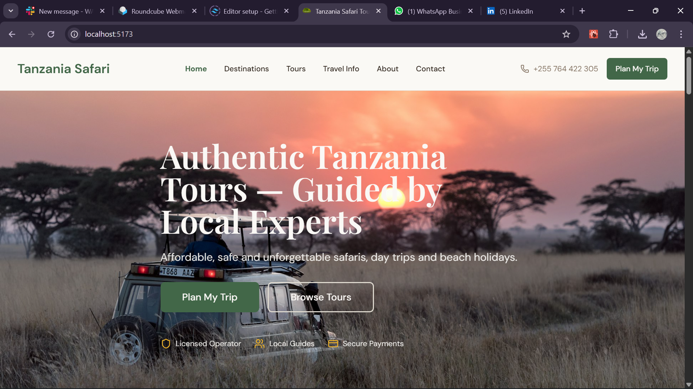
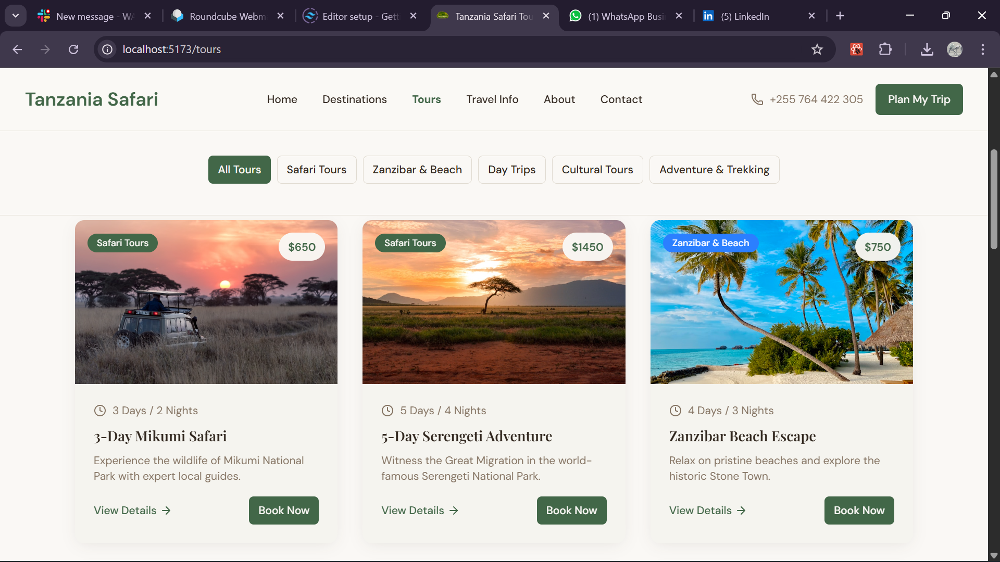
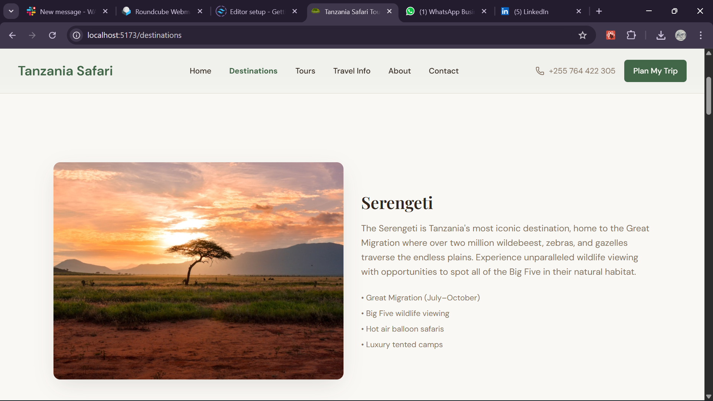

# Tanzania Safari Tours 🌍🦁


A modern, responsive web application to explore **Tanzania safari tours**, destinations, and travel information. Built with **React**, **Vite**, **Tailwind CSS**, and **React Router**.

---

## 🌐 Live Demo

> live demo link (https://neyah-adventure.netlify.app/)





---

## ✨ Features

- Explore curated **Neyah Adventure** with itineraries, highlights, and pricing.
- Discover top **destinations** with full descriptions and stunning images.
- **Tour detail pages** with image galleries and highlights.
- Fully **responsive design** for mobile, tablet, and desktop.
- Dark mode support.
- Google Maps integration for locations.
- Smooth scrolling & animated UI elements.
- Notifications with **Sonner & Toaster**.
- State management & data fetching with **React Query**.

---

## 🛠 Technologies Used

| Frontend                  | Styling / UI           | State & Data       | Utilities & Tools           |
|----------------------------|----------------------|-----------------|----------------------------|
|  |  |  |  |
|  |  | |  |
|  |  | |  |

---

## 📂 Project Structure

```text
tanzania_safari/
├─ src/
│  ├─ components/       # Reusable UI components
│  ├─ data/             # Tours & destinations data
│  ├─ hooks/            # Custom React hooks
│  ├─ lib/              # Utilities & helper functions
│  ├─ pages/            # Page components
│  ├─ App.jsx
│  ├─ main.jsx
│  └─ index.css
├─ public/              # Static assets & images
├─ tailwind.config.js
├─ postcss.config.js
├─ vite.config.js
├─ package.json
└─ README.md

```

## Getting Started

- Clone the repository
```
        git clone https://github.com/Benon78/tanzania-safari.git
        cd tanzania-safari

```

- Install all dependencies
```
        npm install

```
- Run development server
```
    npm run dev

```

## 🤝 Contributing

- Fork the project
- Create a branch: **git checkout -b feature/your-feature**
- Commit your changes: **git commit -m "Add feature"**
- Push to branch: **git push origin feature/your-feature**
- Open a pull request

## 📞 Contact

- Maintainer: Benjamin William
- Email: wilbenjamin7@gmail.com
- Phone: +255 764 422 305
- GitHub: (https://github.com/Benon78)